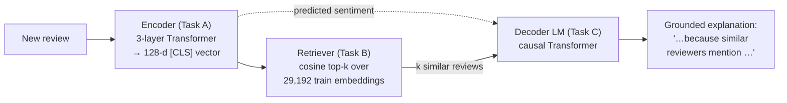
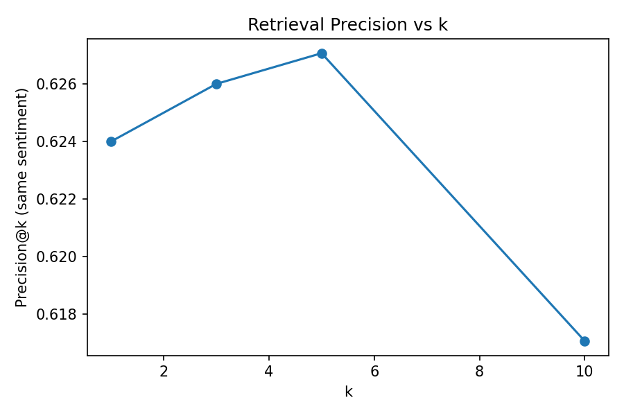
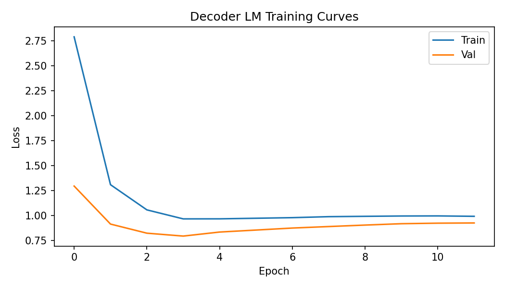

# Retrieval-Augmented Generation (RAG) for Explainable Sentiment Analysis

A from-scratch RAG system — **no HuggingFace, no pre-trained models** — that explains the
sentiment of a product review by grounding its explanation in evidence retrieved from similar
reviews. The Transformer encoder, multi-head attention, retriever, and decoder language model are
all implemented in raw PyTorch.

> **The deliverable is [`rag_agent.py`](rag_agent.py)** — a single command takes one review and runs
> the full **encode → retrieve → generate** loop end-to-end.

```bash
python rag_agent.py --review "This thing broke after two days, total waste of money."
```

```
PREDICTED SENTIMENT:  Negative

RETRIEVED SIMILAR REVIEWS  (the 'R' in RAG)
  1. (Negative, sim=0.993) this head set completely sucks do not waste your money on this junk ...
  2. (Negative, sim=0.991) this does not work, returned it the same week, complete garbage ...
  ...

GROUNDED EXPLANATION  (the 'AG' in RAG)
  this review is negative because similar reviewers mention broke refund junk
```

---

## What this is (and what it is not)

This is a **classic three-stage RAG pipeline** for a constrained generation task. It is *not* an
LLM wrapper — every component is trained here from the raw review corpus:

| Stage | File | What it does |
|-------|------|--------------|
| **A — Encoder** | [`Task_A.py`](Task_A.py) | A 3-layer Transformer encoder trained multi-task (sentiment + length). Its `[CLS]` vector is the dense representation used for retrieval. |
| **B — Retriever** | [`Task_B.py`](Task_B.py) | Cosine top-_k_ search over the encoded training corpus. Builds the retrieved-context string for each query. |
| **C — Decoder LM** | [`Task_C.py`](Task_C.py) | A causal Transformer decoder that generates the grounded explanation, conditioned on the review **and** the retrieved context. |
| **Agent** | [`rag_agent.py`](rag_agent.py) | Wires A+B+C into one callable / CLI for inference on new reviews. |
| **Shared core** | [`rag_common.py`](rag_common.py) | Single source of truth for architectures, tokenizer, sequence format, and the grounded target. |

---

## Architecture



**Encoder** — token embeddings + sinusoidal positional encoding → 3 pre-norm Transformer blocks
(4 heads, 128-d, 256-d FFN) → two linear heads (sentiment, length). Trained with class-weighted
cross-entropy and a Noam warmup schedule.

**Retriever** — L2-normalised `[CLS]` embeddings, brute-force cosine similarity (vectorised matmul).
Self-retrieval is masked out when a training review queries the training index.

**Decoder** — causal (masked) self-attention Transformer LM. Input sequence:
`[BOS] [SENT] [LEN] <review tokens> | <retrieved-context tokens>`; it autoregressively generates the
explanation. Loss is computed over the target span only.

---

## The honest RAG design (what was fixed)

A naïve version of this task is **rigged against RAG**: if the explanation target is copied from the
query review itself, retrieved context can only add noise, and the baseline always "wins." This
project deliberately avoids that trap.

**The target is grounded in the neighbours, not the query.** The explanation is:

```
this review is <sentiment> because similar reviewers mention <evidence words>
```

where the `<evidence words>` are the most common content words **across the retrieved neighbours
that do _not_ appear in the query review** (see
[`neighbour_evidence_words`](rag_common.py)). By construction those words are only obtainable through
retrieval. This makes the ablation a *controlled* one:

- **With RAG** — the retrieved context is in the input → the model can see the evidence words → low perplexity.
- **Without RAG** — the evidence words are unobtainable → high perplexity.

The decoder is trained on **real retrieved context** for the train and validation splits (the earlier
iteration trained on empty placeholder context, which is why retrieval appeared useless). Both
ablation conditions share the *same* target, differing only in whether the retrieved context is
present — so the perplexity gap measures genuine retrieval value.

---

## Results

> Reduced-scale configuration so the decoder retrains on a **CPU in ~30 minutes**
> (4,000 train reviews · 4 epochs · 96-token source). The encoder and the 29,192-vector retrieval
> index are reused from the full corpus.

### Retrieval quality — Precision@k (fraction of neighbours sharing the query sentiment)

| @1 | @3 | @5 | @10 |
|----|----|----|-----|
| 0.624 | 0.626 | 0.627 | 0.617 |



### RAG ablation — perplexity of the grounded explanation

| Configuration | Perplexity |
|---------------|-----------|
| **With retrieved context (RAG)** | **__PPL_RAG__** |
| Without context (baseline) | __PPL_NORAG__ |
| **Relative improvement from retrieval** | **__PPL_IMPROV__** |



Sample generations (with vs. without retrieval) are in
[`results/sample_generations.json`](results/sample_generations.json), and the raw metrics in
[`results/ablation.json`](results/ablation.json).

### Encoder classification (from the full-corpus training, Task A)

| Task | Weighted F1 | Notes |
|------|-------------|-------|
| Length bucket | 0.93 | easy, well separated |
| Sentiment | 0.52 | hard — heavy class imbalance (Positive ≫ Negative ≫ Neutral) |

---

## Project structure

```
.
├── rag_agent.py        ← deployable end-to-end RAG agent (encode → retrieve → generate)
├── rag_common.py       ← shared models, tokenizer, sequence format, grounded target
├── clean_data.py       ← raw CSV → cleaned splits + vocabulary
├── make_datasets.py    ← builds the raw corpus from Amazon review dumps
├── Task_A.py           ← encoder training (multi-task: sentiment + length)
├── Task_B.py           ← retrieval: contexts for train / val / test + Precision@k
├── Task_C.py           ← decoder LM training + RAG ablation
├── data/               ← train/val/test.csv, vocab.json (33,476 tokens)
├── models/             ← encoder_best.pt, decoder_best.pt
└── results/            ← embeddings, contexts, curves, ablation.json
```

---

## Reproduce

```bash
pip install -r requirements.txt

python clean_data.py     # (optional) rebuild splits + vocab from Haseeb.csv
python Task_A.py         # train encoder  → models/encoder_best.pt, results/train_embeddings.npy
python Task_B.py         # retrieve        → results/{train,val,test}_contexts.csv
python Task_C.py         # train decoder + ablation → models/decoder_best.pt, results/ablation.json

python rag_agent.py --review "Best purchase I've made all year!"   # run the agent
python rag_agent.py                                                 # interactive loop
```

> **Encoder reuse:** `Task_B`/`Task_C`/`rag_agent` load the existing `encoder_best.pt` and
> `train_embeddings.npy`; you only need to re-run `Task_A` if you change the encoder.

---

## Implementation notes

- **Everything is hand-rolled:** scaled dot-product attention, multi-head attention, sinusoidal
  positional encoding, the Noam LR schedule, causal masking, and teacher-forced LM loss are all in
  [`rag_common.py`](rag_common.py) — no `nn.Transformer`, no tokenizer library.
- **Dataset:** Amazon product reviews; rating → sentiment (1–2 Negative, 3 Neutral, 4–5 Positive),
  word-count → length bucket. Word-level vocabulary, min frequency 2.
- **Hardware:** runs on CPU. Swap in CUDA and raise `TRAIN_N` / `EPOCHS` / `DEC_SRC_LEN` in
  `Task_C.py` + `rag_common.py` for full-scale training.

---

## Possible extensions

- Approximate nearest-neighbour index (FAISS) to scale retrieval beyond brute-force cosine.
- Cross-attention from the decoder onto encoded neighbours, instead of concatenating context as tokens.
- Hybrid lexical + dense retrieval (BM25 + embeddings) and a learned re-ranker.
